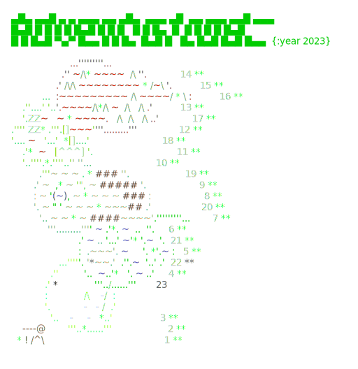

# Advent of Code (2023-2023)

C# solutions to the Advent of Code problems.
Check out https://adventofcode.com

<a href="https://adventofcode.com"></a>

## Usage

```
dotnet run -- [arguments]

1) To run the solutions and admire your advent calendar:

 [year]/[day|all]      Solve the specified problems
 today                 Shortcut to the above
 [year]                Solve the whole year
 all                   Solve everything

 calendars             Show the calendars

2) To start working on new problems:
login to https://adventofcode.com, then copy your session cookie, and export
it in your console like this

 export AOC_SESSION=73a37e9a72a...

then run the app with

 update [year]/[day]   Prepares a folder for the given day, updates the input,
                       the readme and creates a solution template.
 update today          Shortcut to the above.

3) To upload your answer:
set up your AOC_SESSION variable as above.

 upload [year]/[day]   Upload the answer for the selected year and day.
 upload today          Shortcut to the above.

```

